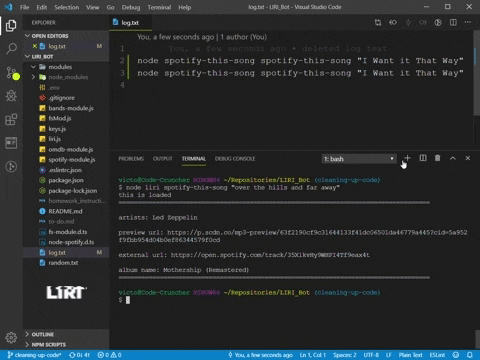

# LIRI-Bot

## Purpose

### This is a LIRI-Bot (_Language Interpretation and Recognition Interface_). It was made in order to simplify the search for movie, artist, and song data. It is a quick way to get the exact information a user seeks, no more, no less. There is also a _log.txt_ file which the program can write commands to.

## Organization

### LIRI-Bot is organized into five modules and two text files. Each module has a specific function and is linked to the main file through the use of require and export statements.

### Three modules are for interfacing with the **Bands in Town**, **Spotify**, and **OMDB** APIs (_Application Programming Interface_) in order to pull queried data from their databases.

### The other two are the File-System module and the Keys module. These are referenced in order to read and write to each text file(_stream data to and from_) and to save and keep API keys respectively.

## Use

### The app is used by downloading the files onto the user's PC. Node.js is required in order for it's use, which can be downloaded <a href="https://nodejs.org/en/download/">**here**</a>.

### Once the user has both of these, they need to enter their command prompt inside the directory (_LIRI-Bot folder_) where LIRI is saved. The user can then find information by entering commands in the form of:

| Node Reference | LIRI Reference | Command           | Query        |
| -------------- | -------------- | ----------------- | ------------ |
| node.js        | liri.js        | concert-this      | Artist Name  |
| node.js        | liri.js        | omdb-this         | Movie Title  |
| node.js        | liri.js        | spotify-this-song | "Song Title" |
| node.js        | liri.js        | call-from-file    | null         |

## Technology

Include screenshots, gifs or videos of the app functioning
Contain a link to a deployed version of the app
Clearly list the technologies used in the app
State your role in the app development
